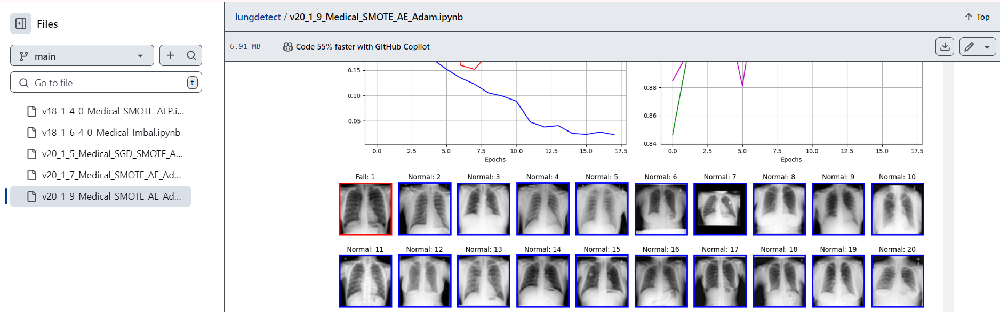
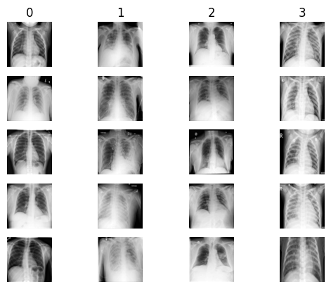

# COVID and Lung Disease Detection

<!-- Please contact me via email to request the source code for this project. -->
$${\color{red}Please \space contact \space me \space via \space email \space to \space request \space the \space source \space code \space for \space this \space project.}$$

## Table of Contents

- [About Project](#about-project)
- [Description](#description)
- [Feature](#feature)
- [Result](#result)
- [Technologies](#technologies)

## About Project

**Result Visualization**.

**Dataset: Normal (0), Lung Opacity (1), COVID (2) and Viral Pneumonia (3).**

## Description
Detecting COVID and lung disease by integrating deep learning models, convolutional autoencoders, and synthetic sampling on large-scale chest X-ray datasets, improving the F1 score to 0.951, Geometric mean to 0.967.

## Feature

| Feature                               | Details     | 
|---------------------------------------|-------------|
| *Data Preprocessing*| • Employed a dataset with 4 classes: Normal, Lung Opacity, COVID and Viral Pneumonia, with 21000 samples.   • Partitioned datasets into 2% independent test sets and imbalanced sets.|
| *Balancing Data based on train-generate process*| Balanced imbalanced sets across 4 classes during the train-generate process using convolutional autoencoder for deep feature extraction and SMOTE for sample balancing, incorporating penalty.|
| *Classification model*| • Divided *balanced data* into 80% training and 20% validation sets for classification models.   • Used ResNet18 (optimizer: Adam, SGD) for classification and optimized it, Weight Decay to prevent overfitting, Early Stopping with a patience of 10 to avoid overtraining, Dropout, and lr_scheduler: ReduceLROnPlateau.| 
| *Evaluation and Data visualization*| • Conducted confusion matrix analysis across 4 classes to assess prediction accuracy and identify misclassifications.   • Applied data visualization to analyze true/false predictions for 400 cases.|

## Result

| Datasets                               | Details     | 
|---------------------------------------|-------------|
| Normal, COVID and Viral Pneumonia | Achieved accuracy: 0.977. |
| Normal, Lung Opacity, COVID and Viral Pneumonia | Improved F1 score to 0.951, Geometric mean to 0.967|

## Technologies

| Category                               | Tools/Technologies     | 
|---------------------------------------|-------------|
| *Programming* | Python |
| *Frameworks* | PyTorch, TensorFlow |
| *Libraries* | Scikit-learn, sklearn-pandas, Torchvision, NumPy, Pandas, Matplotlib, Seaborn, SciPy|
| *AutoEncoder variants* | Convolutional AE|
| *Classification* | ResNet18, optimizer (Adam, SGD)|
| *Environment* | Google Colab (for development and code execution) |

